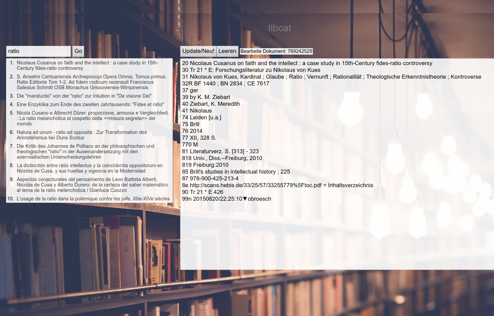

# libcat

libcat - a simple librarians catalogue with allegro-style input for kittens (POW!), initially developed for:

> Bibliotheksverbund Trier-Klausen-Kues



## Todo

### user-interface-related
- [x] simple query search ($sqs) giving a list of results in the Search-component
- [x] clicking one result loads the associated item in the BookEditBox-component
- [ ] make new catalogue item (use generated _ids by ES)
    - [x] simple doc
    - [ ] child doc
    - [ ] nested doc
- [ ] GVK import by identifier (PPN)
- [ ] user authentification
- [ ] pretty print catalogue card

### DB-related

- [x] import allegro data, see import folder, manage the following points (see the "mappings" in test-elastic.js)
    - [x] only one index type (doc) - as envisioned for ES6 (_doc)
    - [x] connect articles with books they are in, via allegro #849 field and ES-parent-child-relation. Rationale: We need 84 for regular entries of higher tier writings (übergeordnete Werke), so let's use the last slot of 84 (the 9th) for the join.
    - [x] have volumes of books connected via ES-nested-objects field: sub

## About

This project uses [Feathers](http://feathersjs.com). An open source web framework for building modern real-time applications.

Elasticsearch (ES) as catalogue backend. For no particular reason I chose ES 5.6. Upgrading to higher versions of ES is definitely a goal.

[Mithril.js](https://mithriljs.org) as frontend gui lib. Why not React Native? Because mithril is awesome and building for small screens and touch interface is a non-goal. Working with libcat better suits desktop/laptop scenario.

## Getting Started

Getting up and running is as easy as 1, 2, 3.

0. Install Elasticsearch and run it as a service. (5.6!)
1. Make sure you have [NodeJS](https://nodejs.org/) and [npm](https://www.npmjs.com/) installed.
2. Install your dependencies

    ```
    cd path/to/bvtkk-app; npm install
    ```

3. Start your app

    ```
    npm start
    ```

## Testing

Simply run `npm test` and all your tests in the `test/` directory will be run.

> No tests as of now.

## Scaffolding

Feathers has a powerful command line interface. Here are a few things it can do:

```
$ npm install -g @feathersjs/cli          # Install Feathers CLI

$ feathers generate service               # Generate a new Service
$ feathers generate hook                  # Generate a new Hook
$ feathers generate model                 # Generate a new Model
$ feathers help                           # Show all commands
```

## Help

For more information on all the things you can do with Feathers visit [docs.feathersjs.com](http://docs.feathersjs.com).

## Changelog

__0.1.0__

- Initial release

## License

Copyright (c) 2016

Licensed under the [MIT license](LICENSE).
